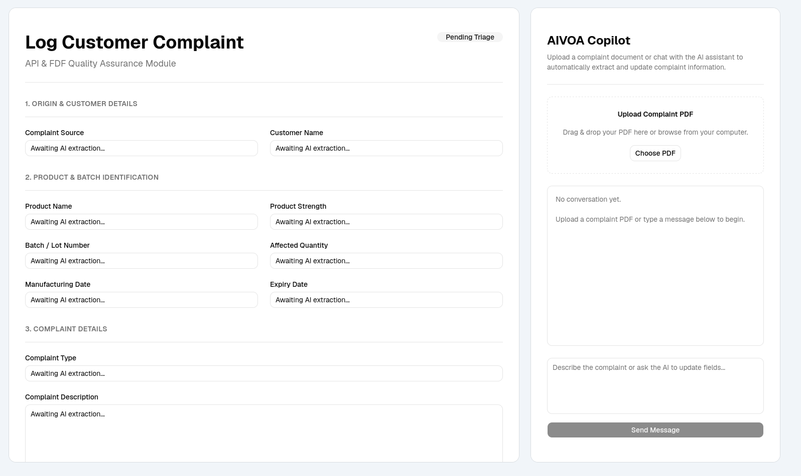
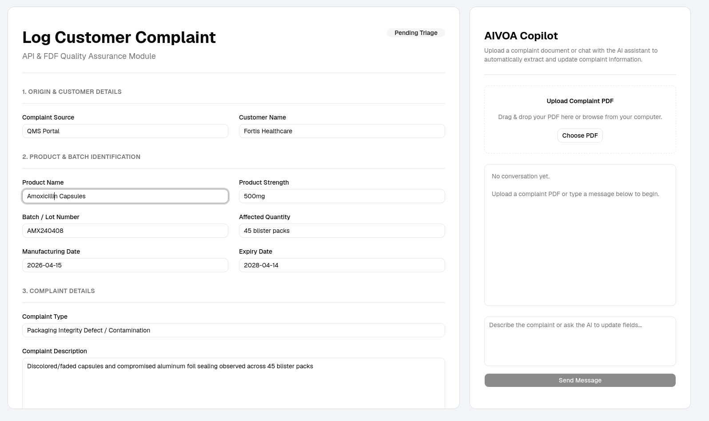

# AIVOA Complaint Frontend

Frontend application for an AI-powered Pharmaceutical Quality Management System (QMS) Customer Complaint module.

The application enables users to upload pharmaceutical complaint PDFs, review AI-generated complaint information, update complaint details using natural language, and commit approved complaints to the QMS Ledger.

---

## Screenshots

### Initial Application



### AI Generated Complaint



---

## Features

- Upload pharmaceutical complaint PDF documents
- AI-generated structured complaint form
- Read-only complaint review interface
- AI-powered complaint updates using natural language
- AI-generated Risk Assessment
- Commit complaint to QMS Ledger
- Loading indicators during AI processing
- Success and error notifications
- Global state management with Redux Toolkit

---

## Tech Stack

- React
- TypeScript
- Vite
- Redux Toolkit
- Axios
- Tailwind CSS
- shadcn/ui
- Sonner

---

## Project Structure

```text
src/
├── api/
├── components/
│   ├── assistant/
│   ├── complaint/
│   ├── layout/
│   ├── ui/
├── store/
├── types/
├── lib/
├── App.tsx
└── main.tsx
```

---

## Setup

### Clone Repository

```bash
git clone https://github.com/Paresh-29/aivoa-complaint-frontend.git
cd aivoa-complaint-frontend
```

---

### Install Dependencies

```bash
npm install
```

---

## Environment Variables

Create a `.env` file in the project root.

```env
VITE_API_URL=http://localhost:8000/api/v1
```

---

## Run Development Server

```bash
npm run dev
```

The frontend will be available at:

```text
http://localhost:5173
```

---

## Application Workflow

1. Upload a pharmaceutical complaint PDF.
2. AI extracts complaint information through the backend.
3. Review the generated complaint form.
4. Update complaint details using natural language.
5. Review the AI-generated Risk Assessment.
6. Commit the approved complaint to the QMS Ledger.

---

## User Interface

The application consists of four primary sections:

### Upload Area

- Upload pharmaceutical complaint PDF documents.
- Displays upload progress while AI processes the document.

### Complaint Panel

- Displays AI-generated structured complaint information.
- Shows customer, product, batch, complaint, severity, and priority details.

### AI Copilot

- Update complaint information using natural language instructions.
- Automatically refreshes the complaint form after every update.

### AI Risk Assessment

Displays AI-generated:

- Severity
- Priority
- Suggested Action
- Risk Assessment

---

## Backend

The frontend communicates with the FastAPI backend through REST APIs.

Backend Repository:

```text
https://github.com/Paresh-29/aivoa-complaint-backend
```

---

## Author

**Paresh Barick**
